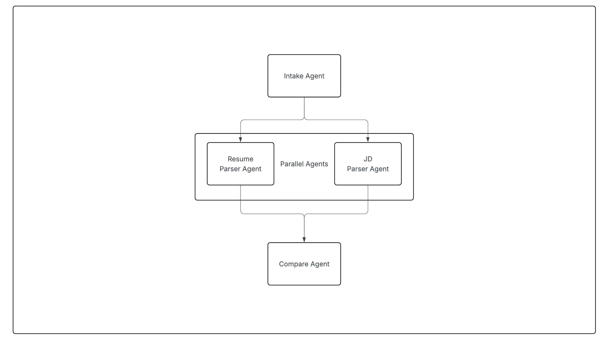
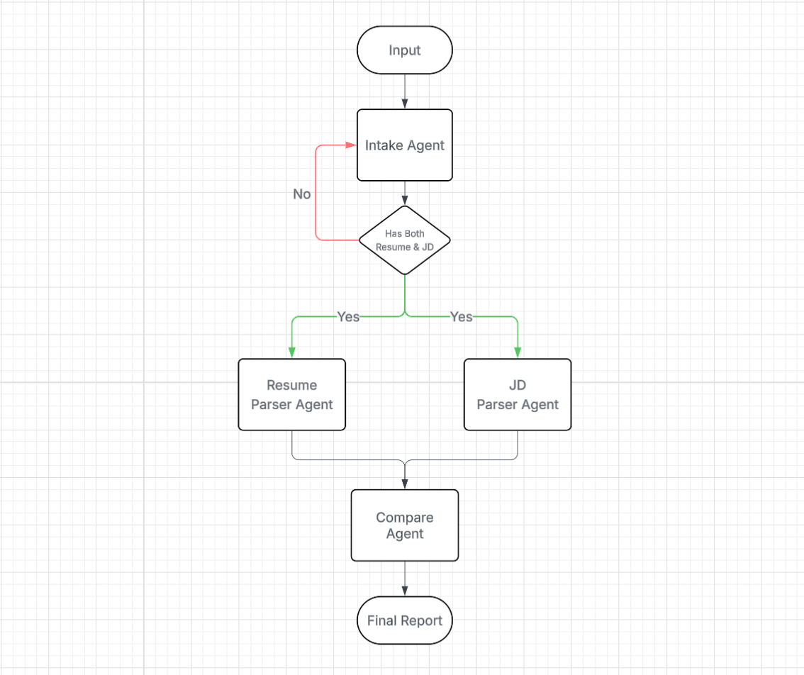

# 🧠 AI Resume ATS Scanner
An intelligent, multi-agent ATS scanner that compares a candidate’s resume with a job description and generates a detailed, ATS-style compatibility report.
Built using Google ADK, orchestrated through sequential + parallel agents, and powered by Gemini models.

# 📌 Problem Statement
Job seekers often apply blindly to job postings without knowing:
- How well their resume matches the job description
- Which skills they are missing
- What keywords to include
- What improvements would increase the chances of selection

Manually comparing a resume and JD is:
- ⏳ Slow
- 🔍 Error-prone
- 🎯 Hard to optimize
- 😫 Frustrating

This leads to poor targeting, low callback rates, low chances of being shortlisted.

# ✅ Solution
This project automates resume–JD comparison using a multi-agent GenAI pipeline:
- Extracts structured data from both documents
- Identifies strengths, weaknesses, and keyword gaps
- Calculates a match score (0–100)
- Generates actionable improvement suggestions
- Produces a clean ATS-style report

Users simply paste:
```
Resume:
<resume>

JD:
<job description>
```

The system handles validation, extraction, comparison, and report generation end-to-end.

# 🤖 Multi-Agent Architecture
The system uses Google ADK to orchestrate agents in both sequential and parallel flows.

Agent Breakdown

| Agent | Responsibility |
|---|---|
|**Intake Agent** | Collects & validates user inputs (resume + JD). Requests missing data. |
|**Resume Parser Agent** | Extracts skills, experience, keywords, and metadata from the resume. |
|**JD Parser Agent** | Extracts responsibilities, required skills, keywords, expectations. |
|**Compare Agent** | Compares resume vs JD, calculates match score & generates a final report. |

# 🏗️ Architecture & Flow Diagram



# 📂 Directory Structure

```
Directory structure:
└── resume_ats_checker/
    ├── agents/
    │   ├── agent.py
    │   ├── sub_agents/
    │   │   ├── compare_agent.py
    │   │   ├── intake_agent.py
    │   │   ├── jd_agent.py
    │   │   ├── resume_agent.py
    │   │   └── __init__.py
    │   └── __init__.py
    ├── assets/
    │   ├── Flowchart.png
    │   └── screenshots/
    ├── config.py
    ├── README.md
    ├── requirements.txt
    └── __init__.py
```

# 🛠️ Technologies Used
- **Google ADK** – Multi-agent orchestration

- **Gemini Models** – LLM extraction & analysis

- **Python** – Core logic

- **Parallel & Sequential Agents** – Efficient processing

- **InMemory sessions** - handled by adk

- **Modular clean architecture**

# ⚙️ Setup & Installation

1. Clone the Repository
```
https://github.com/abhishekkokate/ai_resume_ats_scanner.git
cd resume-ats-checker
```

2. Install Dependencies
```
pip install -r requirements.txt
```

3. Add Env variables

add a `.env` file with below details:
```
GOOGLE_API_KEY="<your-key>"
GEMINI_MODEL="gemini-2.5-flash"
```

4. Start the project
```
adk web .
```

5. Open the webUI and start using

Open below URL in the browser
```
http://127.0.0.1:8000/
```

# How It Works

1. **User Input:** User pastes resume & JD. Missing data is auto-requested.
2. **Parallel Extraction:** Resume Agent & JD Agent run simultaneously.
3. **Comparison:** Compare Agent generates:
    - Match score
    - Strengths
    - Gaps
    - Missing keywords
    - Improvement suggestions
4. **Final ATS report:** Delivered in clean JSON
